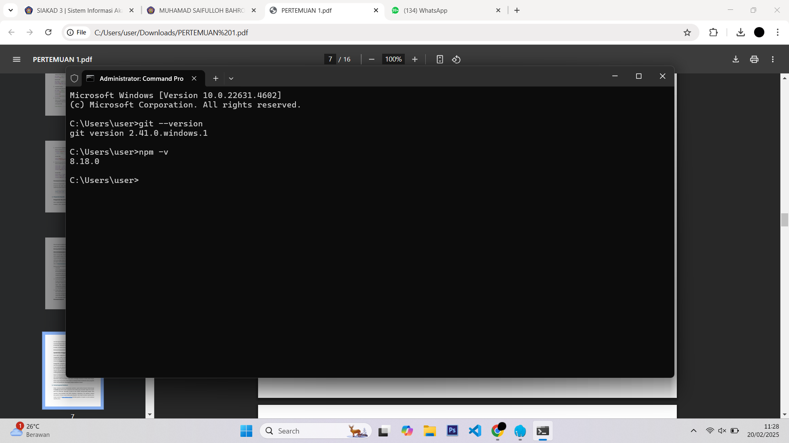
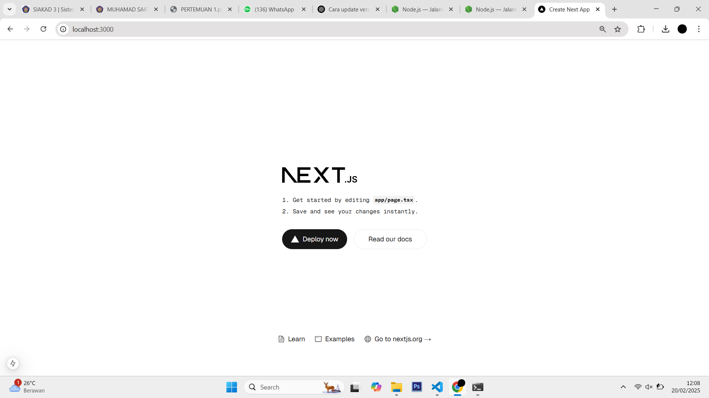
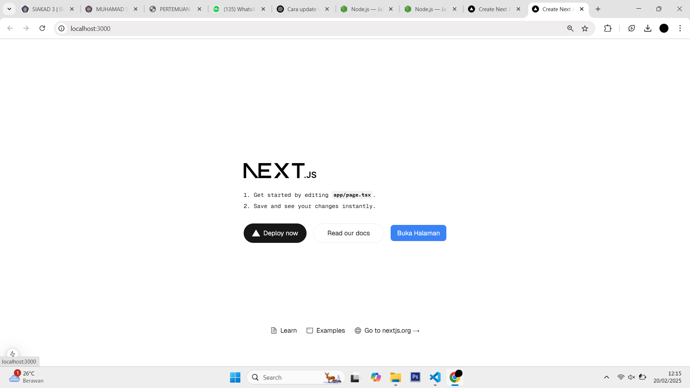
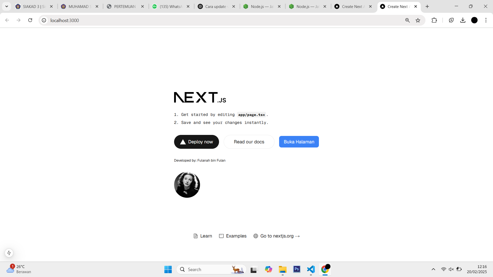

This is a [Next.js](https://nextjs.org) project bootstrapped with [`create-next-app`](https://nextjs.org/docs/app/api-reference/cli/create-next-app).

## Getting Started

First, run the development server:

```bash
npm run dev
# or
yarn dev
# or
pnpm dev
# or
bun dev
```

Open [http://localhost:3000](http://localhost:3000) with your browser to see the result.

You can start editing the page by modifying `app/page.tsx`. The page auto-updates as you edit the file.

This project uses [`next/font`](https://nextjs.org/docs/app/building-your-application/optimizing/fonts) to automatically optimize and load [Geist](https://vercel.com/font), a new font family for Vercel.

## Learn More

To learn more about Next.js, take a look at the following resources:

- [Next.js Documentation](https://nextjs.org/docs) - learn about Next.js features and API.
- [Learn Next.js](https://nextjs.org/learn) - an interactive Next.js tutorial.

You can check out [the Next.js GitHub repository](https://github.com/vercel/next.js) - your feedback and contributions are welcome!

## Deploy on Vercel

The easiest way to deploy your Next.js app is to use the [Vercel Platform](https://vercel.com/new?utm_medium=default-template&filter=next.js&utm_source=create-next-app&utm_campaign=create-next-app-readme) from the creators of Next.js.

Check out our [Next.js deployment documentation](https://nextjs.org/docs/app/building-your-application/deploying) for more details.


## Laporan Praktikum

|  | Pemrograman Berbasis Framework 2025 |
|--|--|
| NIM |  244107027015|
| Nama |  Muhamad Saifulloh Bahroin Gana Perkasa |
| Kelas | TI - 4K |


### Jawaban Praktikum 1

Git: Mengelola versi kode, melacak perubahan, dan berkolaborasi dalam pengembangan.
VS Code: Editor kode yang ringan dengan fitur debugging, ekstensi, dan terminal bawaan.
Node.js: Menjalankan JavaScript di server, mengelola dependensi dengan npm, dan membangun aplikasi web.




### Jawaban Praktikum 2

TypeScript: Superset dari JavaScript dengan fitur tipe statis untuk meningkatkan keamanan dan keandalan kode.
ESLint: Alat untuk mendeteksi dan memperbaiki kesalahan dalam kode JavaScript/TypeScript sesuai dengan aturan yang ditentukan.
Tailwind CSS: Framework CSS yang berbasis utility-first untuk membuat desain yang cepat dan fleksibel.
App Router: Sistem routing di Next.js yang berbasis file dan menggunakan konsep server components untuk pengelolaan halaman.
Import Alias: Fitur untuk mengganti path panjang dengan alias yang lebih pendek dan mudah digunakan dalam proyek.
Turbopack: Bundler modern yang menggantikan Webpack di Next.js untuk proses build dan hot reload yang lebih cepat.

> .next
Folder ini berisi hasil build proyek Next.js, termasuk file yang telah dikompilasi dan di-cache.
Tidak perlu diedit secara manual karena dibuat secara otomatis oleh Next.js.

> node_modules
Berisi semua dependensi atau pustaka yang diinstal melalui npm atau yarn.
Jangan edit secara langsung; gunakan package.json untuk mengelola dependensi.

> public
Tempat menyimpan aset statis seperti gambar, favicon, dan file lainnya.
File di dalam folder ini dapat diakses langsung melalui URL, misalnya /logo.png.

> src/app
Folder utama untuk mengelola halaman dan komponen dalam proyek Next.js.
Menggunakan sistem App Router (app/) yang berbasis server components untuk routing yang lebih modern.




### Jawaban Praktikum 3



### Jawaban Praktikum 4

user.imageUrl digunakan untuk mengakses URL gambar profil dari objek user, biasanya untuk menampilkan foto pengguna di aplikasi web

